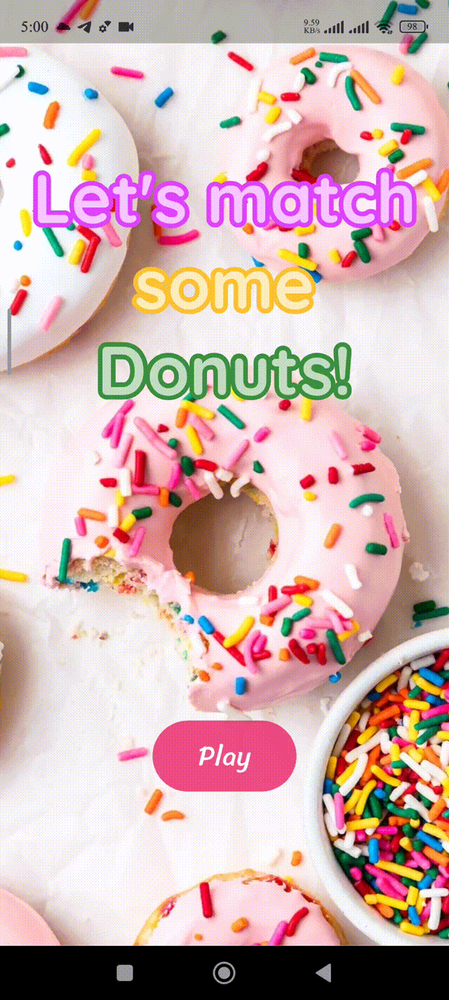

# Match the Donuts! 🍩

**A vibrant and engaging memory puzzle game built with Flutter.**

This project is a simple yet addictive memory-based puzzle game where players are challenged to find and match 6 pairs of colorful donuts hidden in randomized positions. It'''s designed to be a fun, casual game experience with continuous rounds, scoring, and background music to keep players engaged.

## 🌟 Features

*   **Engaging Gameplay**: Simple to learn, but challenging to master. Find all the pairs before your health runs out!
*   **Randomized Donut Grid**: The position of the donuts is shuffled every round, offering a new challenge each time.
*   **Continuous Rounds**: The game continues with new rounds, progressively keeping the player engaged.
*   **Scoring System**: A simple scoring system to track player performance.
*   **Health System**: Players have limited attempts, adding a layer of challenge.
*   **Sound Effects & Music**: Background music to enhance the gaming experience.
*   **Responsive UI**: A clean and intuitive user interface that works on various screen sizes.

## 🎮 Gameplay



## 🛠️ Tech Stack

This game was built using the following technologies and architectural patterns:

*   **Framework**: [Flutter](https://flutter.dev/)
*   **Language**: [Dart](https://dart.dev/)
*   **State Management**: [Riverpod](https://riverpod.dev/) - Used for managing game state, player scores, and health in a robust and scalable way.
*   **Audio**: `just_audio` package for handling background music.
*   **Architecture**: The project follows a clean architecture, separating UI, game logic, and data models for better maintainability.

---

## 📂 Project Structure

```
lib/
 ├── data/
 ├── models/
 ├── providers/
 ├── screens/
 ├── widgets/
 └── main.dart
```

---

## ⚙️ Installation & Setup

```bash
# Clone the repository
git clone https://github.com/OmarTarakji/match_the_donuts.git

# Navigate into the project
cd match_the_donuts

# Install dependencies
flutter pub get

# Run the app
flutter run
```

## 📄 License

This project is licensed under the MIT License - see the `LICENSE` file for details.

---

## 📬 Contact

👤 **Omar Tarakji**
- Email: o.tarakji2001@gmail.com
- LinkedIn: https://www.linkedin.com/in/omar-tarakji/

---